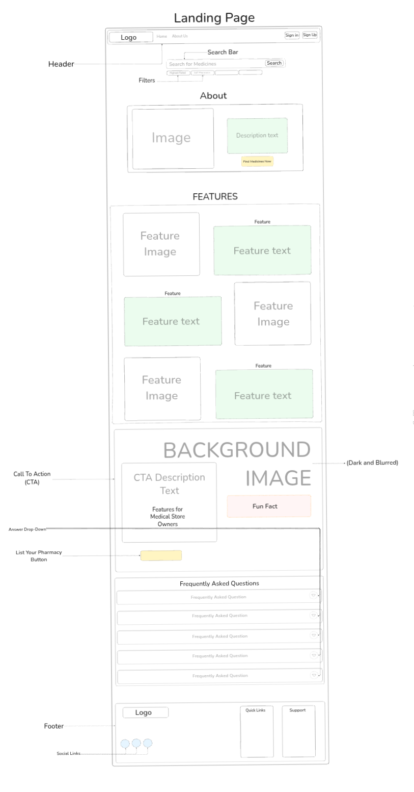
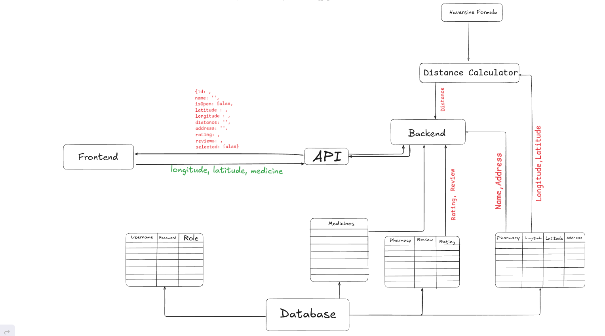
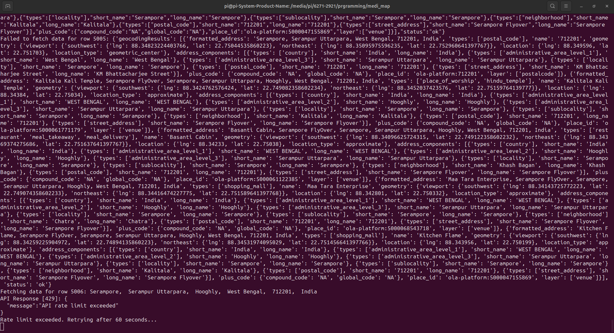

# NearByMedi

**Tagline:** Healthcare, simplified.

## Problem Statement
Finding medicines can be challenging because medicines are often available at one shop but not at others. This creates inconvenience for people in need of specific medications.

## Solution
NearByMedi provides a system where:
1. **Users:** Can search for medicines and find the nearest shop that has the medicine in stock. Additionally, it provides a map and directions to the shop for convenience.
2. **Shop Owners:** Can upload Excel sheets of medicines available in their shop to add their shop to the system.

---

## Landing Page
Here is a screenshot of the landing page for the application:

---

## Workflow
Below is the backend flowchart illustrating the system architecture of "NearByMedi":

### Diagram Description
The flowchart shows how different components of the system interact:
1. **Frontend**:
   - Users can search for medicines, and shop owners can upload Excel sheets.
2. **API**:
   - Mediates between the frontend and backend.
   - Hosted on [Render](https://render.com) for scalability and reliability.
3. **Backend**:
   - Handles core tasks such as querying the database, calculating distances, and processing medicine data.
   - Uses a new external API to fetch medicine descriptions.
4. **Database**:
   - Stores user credentials, pharmacy details, and medicine mappings.
5. **Distance Calculator**:
   - Computes the distance between the user's location and nearby pharmacies using the Haversine formula.

---

## Features
1. **Medicine Search:** Users can search for a medicine to check its availability.
2. **Nearest Shop Locator:** The system identifies and displays the nearest shop where the medicine is available.
3. **Shop Description:** Provides a short description of the shop.
4. **Medicine Details:** Uses a new external API for fetching accurate medicine descriptions.
5. **Map Integration:** Displays a map with directions to the shop.
6. **Shop Owner Dashboard:** Allows shop owners to upload Excel sheets containing details of available medicines to add or update their shop in the system.

---

## User Guide
Here’s how users can use the system:

1. **Step 1: Search**
   - Enter the name of the required medicine and click search.
   

2. **Step 2: View Map**
   - See the nearest shops where the medicine is available on a map.
   - Directions are provided for navigation.
   

3. **Step 3: Navigate**
   - Use the map to navigate to the pharmacy with the desired medicine.
   

---

## Dashboard Design
We explored three dashboard designs and finalized the third one for its simplicity and clarity. Below are the designs:

- **Design 1:**
  

- **Design 2:**
  

- **Design 3 (Final):**
  .png)

---

## Deployment Plans
- **Domain Purchase:** We have purchased the domain [nearbymedi.store](https://nearbymedi.store) to provide users with a professional and easy-to-remember URL.
- **API Hosting:** The Flask API is hosted on [Render](https://render.com) for scalability and reliability.
- **Frontend Hosting:** The frontend is deployed on [nearbymedi.store](https://nearbymedi.store), making the application accessible to all users.

---

## Implementation Details
1. **Backend Data:**
   - We used Kaggle's free dataset: [AZ Medicine Dataset of India](https://www.kaggle.com/datasets/shudhanshusingh/az-medicine-dataset-of-india) to gather information on all available medications in India.
   - For shop coordinates, we sourced data from Wikipedia, OpenStreetMap and OlaMaps API.
   - Integrated a new external API to fetch detailed descriptions of medicines.
2. **Database Limitations:**
   - Due to time constraints, the database currently only covers shops and pharmacies in **West Bengal**.
   - Scraping and preparing data for West Bengal alone took **6+ hours**. Here is a screenshot of the scraping process:
     
3. **Distance Calculation:**
   - The Haversine formula was employed to compute distances between users and pharmacies.
4. **Excel Sheet Processing:**
   - The backend processes Excel files uploaded by shop owners, extracts shop and medicine details, and updates the database.
5. **Frontend Integration:**
   - A user-friendly interface ensures a seamless experience for both users and shop owners.

---

## Challenges Faced
1. **Time Constraints:** Developing the system in just 48 hours required reliance on free assets and open-source libraries.
2. **Data Collection:** Merging data from various sources was time-consuming and challenging.
3. **Dashboard Design:** Iterative design processes were required to finalize the most user-friendly UI.

---

## Use of AI Tools and Old Assets
Due to the limited time and resources available, we leveraged several AI tools and pre-existing assets to expedite the design and development process. These tools helped us with:
1. Creating visual elements and user interface designs.
2. Generating backend flowcharts and diagrams.
3. Utilizing pre-existing templates and datasets.

This allowed us to focus on implementing the core functionality of the project while ensuring a visually appealing and functional user experience.

---

## Future Scope
While the current version of NearByMedi is functional, several planned features remain incomplete due to time constraints. Below is the future scope for the project:

1. **Expanding Database Coverage:**
   - Currently, the database is limited to shops and pharmacies in West Bengal.
   - Expanding the coverage to include other Indian states and eventually nationwide is a priority.

2. **Improving Medicine Descriptions:**
   - The new external API for fetching medicine descriptions has been integrated, but its coverage needs to be enhanced for a broader range of medicines.

3. **Advanced Search Features:**
   - Add filters for price ranges, brand preferences, and shop ratings to improve the user experience.

4. **User Reviews and Ratings:**
   - Allow users to leave reviews and ratings for shops, helping others make informed decisions.

5. **Bug Fixes and Stability Improvements:**
   - Address issues in features that are not fully functional due to time constraints.

6. **Enhanced Dashboard for Shop Owners:**
   - Provide shop owners with analytics, such as most searched medicines and daily traffic data.

7. **Mobile App Development:**
   - Develop Android and iOS applications for better accessibility.

8. **Scaling the System:**
   - Optimize the backend to handle larger datasets and higher traffic as the platform scales.

---

## What We Learned
- The importance of efficient data collection and integration.
- Implementing advanced distance calculation methods such as the Haversine formula.
- Overcoming UI/UX challenges and refining design approaches.
- Leveraging free assets, AI tools, and open-source libraries under tight deadlines.

---

## Team Effort
All team members worked over **12 hours per day** for the last two days to bring this system to life. The hard work and collaboration of the team were crucial to achieving this milestone.
